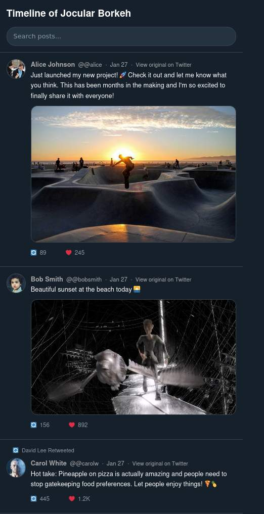

# Touitr
Parse your Twitter archive and make it less shitty.

Generates a folder with a statified Twitter-like clone.

| :warning: WARNING           |
|:----------------------------|
| 🚨🚨 ALL THE HTML/CSS/JAVASCRIPT PART IS 99% VIBECODED 🚨🚨    |


Features:
 * Only one JS file for lazyloading basically
 * Can share a link to a specific post
 * Resolves all the silly `t.co` links
 * Has a working search bar



## Install

```
$ bundle config set path 'vendor/bundle' ; bundle install
```

## Parse the archive

Go to Twitter and export your data. Wait for a day, and then download the .zip

```
$ bundle exec ruby parse.rb <twitter_archive.zip> <destination_folder>
```

and done! Check out your new website:

```
$ cd <destination_folder> ; ruby -run -e httpd . -p 8000
```

And point your browser to `http://localhost:8000`

## Host this somewhere

if you want to host this on `https://example.com/touitr`, edit script.js with:

```
let base_url = "https://example.com/touitr"; // Edit this if you host this not at the root of a VirtualHost
```
