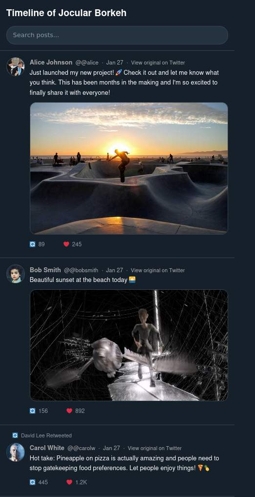

# Touitr
Parse your Twitter archive and build a less shitty version of your Timeline.


Generates a folder with a statified Twitter-like clone.

| :warning: WARNING           |
|:----------------------------|
| 🚨🚨 ALL THE HTML/CSS/JAVASCRIPT PART IS 99% VIBECODED 🚨🚨    |


Features:
 * Only one JS file for lazyloading basically
 * Can share a link to a specific post
 * Resolves all the silly `t.co` links
 * Has a working search bar
 * Only show the timeline of your post, RT, replies, all in one place



## Install

```
$ bundle config set path 'vendor/bundle' ; bundle install
```

## Parse the archive

Go to Twitter and export your data. Wait for a day, and then download the .zip

```
$ bundle exec ruby parse.rb -z <twitter_archive.zip> -d <destination_dir>  -b http://localhost:8080
```
and done! Check out your new website:

```
$ cd <destination_dir> ; ruby -run -e httpd . -p 8000
```

And point your browser to `http://localhost:8000`


You need to specify the base URL where your Touitr archive will be hosted, if it will be at https://example.com/touitr, you need to pass `-b  https://example.com/touitr`


### Extra config

use `-t` flag to change the Twitter host url from `twitter.com` to something else like `fxtwitter.com` or  `nitter.net`.

## Use config.json

You can also use a `config.json` file to store parameters.